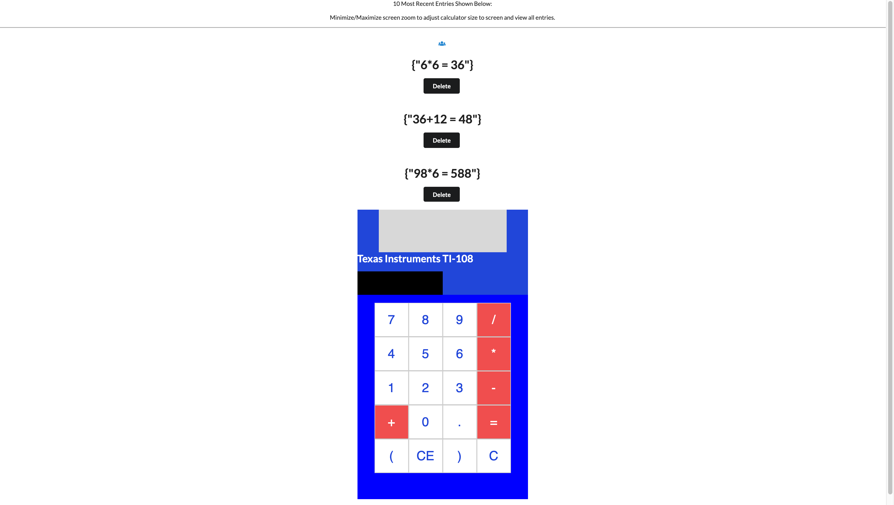

# PROJECT SUMMARY 
This was a code challenge that had the following requirements: 
-   A calculator website which logs calculations as they happen and shares those calculations with everyone connected to the website. 
-   For example, user A and user B go to your site at the same time. User A calculates "5 + 5", which equals "10". This is logged below the calculator as "5+5 = 10". 
-   User B is updated about this calculation right after user A posts it. Now, user B calculates "3x_4". This calculates to 12 and displays "3x_4=12" right below the prior calculation. 
-   User A sees this update immediately after user B posts it. Results should remain between sessions. 
-   Only show the last 10 calculations descending from most recent to oldest. 

# Built With 
 React, PostgreSQL, HTML, CSS, Semantic UI, Redux, 

# Prerequisties 
Software that is required prior to starting the application
-   NPM *(https://www.npmjs.com/get-npm)*
-   Node.js *(https://nodejs.org/en/)*
-   PostgresSQL *(https://www.postgresql.org/download/)* - choose your system and follow those instructions.
    -   Postico was personally used. *(https://eggerapps.at/postico/)* - A modern PostgreSQL client for mac systems.

# Installing - Get the local environment running 
1. Fork/Download/Clone this project
2. Open the terminal in the code folder and type "npm install"
3. Type "npm run server" to start up your server
4. In a different terminal window/tab, type "npm run client" into your terminal to start up your client

# Create database
1. Open the application you're using for your PostgreSQL database
2. Create new database named "react_calculator"
3. Copy SQL text from the database.sql file
4. Paste SQL text into Postico and execute statements to create tables and intial user

# The URL to use the app in local development
If npm run client did not open a new browser/tab for you, in your browser URL, insert *http://localhost:3000/#/schedule* to navigate to the home page of this application and begin demo-ing.

# Next Steps 
- Websockets/Socket.io for DOM to reflect database real time instead of using a set interval refresh rate 
- Change the code to show just numbers and not the object result of the mathmetical equation

# Notes for employers 
- What was exciting about this project? 
    - This was the first code challenge I've ever recieved on the job search. Although I wasn't selected to proceed, I was excitied to learn how to do mathematical functions with React. Prior to this application I did not do any complicated math other than add, subtract, divide, modulus, etc with variables and hard coded numbers. 
    - During this time I was in the final stages of a group client project which put me to the test of juggling a code challenge and finishing a project with the best of my skills and energy divided into two. 
    - I think overall I did a decent job, and I'm still looking for feedback on this code challenge! 
    - It was exciting to try and see what I can juggle betweem and how efficient I could be. It wans't too bad overall. 
    - Please reach out to me for feedback on the code if you'd like! 

# Personal touches that were added 
    - There was no formal design requirement so I decided to design the calulator to mimic a calculator that I had used in middle school, the "Texas Instruments TI-108"
    - I also used Semantic Ui for simple icons and buttons, a friend a reccomended it for it's simplicity. 

